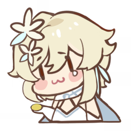

|表情|ID|含义|
|-|:-:|-:|
||1001|交给我吧|
||1002|出货吧！|
||1003|哼哼~|
||1004|该吃饭了|
||1005|吃惊|
||1006|小事一桩|
||1007|不要啊|
||1008|唔…|
||1009|干得漂亮|
||1010|救救我|
||1011|你真幽默|
||1012|给我走开！|
||1013|睡着了|
||1014|拜托~|
||1015|警觉|
||1016|1摩拉可以吗|
||2001|OK|
||2002|乖巧|
||2003|疑问|
||2004|委屈|
||2005|比心|
||2006|哼哼|
||2007|点赞|
||2008|晚安|
||2009|倒|
||2010|暗中观察|
||2011|哦|
||2012|期待|
||2013|吃惊|
||2014|有主意了|
||2015|撒花|
||3001|喝茶|
||3002|我全都要|
||3003|思考|
||3004|摊手|
||3005|叹气|
||3006|得意|
||3007|烦躁|
||3008|无聊|
||3009|超凶|
||3010|傲娇|
||3011|燃起来了|
||3012|气死了|
||3013|赌气|
||3014|我拒绝|
||3015|好饿|
||3016|是摩拉|
||4001|送花|
||4002|没什么|
||4003|怎么了|
||4004|冷|